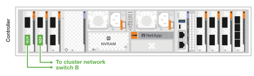

= Câblez le matériel de votre système de stockage AFX 2K
:allow-uri-read: 
:icons: font
:imagesdir: ../media/

[role="lead"]
Après avoir installé le matériel de rack pour votre système de stockage AFX 2K, installez les câbles réseau pour les contrôleurs et connectez les câbles entre les contrôleurs et les tiroirs disques.

.Avant de commencer
Contactez votre administrateur réseau pour obtenir des informations sur la connexion du système de stockage à vos commutateurs réseau.

.À propos de cette tâche
* Ces procédures montrent des configurations courantes.  Le câblage spécifique dépend des composants commandés pour votre système de stockage.  Pour obtenir des détails de configuration complets et les priorités des emplacements, voirlink:https://hwu.netapp.com["Hardware Universe NetApp"^] .
* Les emplacements d'E/S sur un contrôleur AFX 2K sont numérotés de 1 à 11.
+
image::../media/drw_afx_2k_rear_slots_ieops-2862.svg[Numérotation des emplacements sur un contrôleur AFX]

+
[cols="10%,23%,10%,24%,10%,23%"]
|===
| Numéro de l'emplacement | Emplacement d'E/S | Numéro de l'emplacement | Emplacement d'E/S | Numéro de l'emplacement | Emplacement d'E/S 

 a| 
image::../media/icon_round_1.svg[Numéro d'appel 1]
| HA  a| 
image::../media/icon_round_4.svg[Callout numéro 4]

image::../media/icon_round_5.svg[Callout numéro 5]
| NVRAM12  a| 
image::../media/icon_round_9.svg[Callout numéro 9]
| Réseau 

 a| 
image::../media/icon_round_2.svg[Numéro d'appel 2]
| Cluster  a| 
image::../media/icon_round_6.svg[Callout numéro 6]

image::../media/icon_round_7.svg[Callout numéro 7]
| NVRAM12-EX  a| 
image::../media/icon_round_10.svg[Callout numéro 10]
| Stockage 

 a| 
image::../media/icon_round_3.svg[Callout numéro 3]
| Réseau  a| 
image::../media/icon_round_8.svg[Callout numéro 8]
| Stockage  a| 
image::../media/icon_round_11.svg[Callout numéro 11]
| (*Optionnel*) Quatre ports 25GbE SFP28 pour une connectivité de gestion supplémentaire 
|===
* Les graphiques de câblage affichent des icônes de flèche indiquant l'orientation correcte (vers le haut ou vers le bas) de la languette de traction du connecteur de câble lors de l'insertion d'un connecteur dans un port.
+
Lorsque vous insérez le connecteur, vous devez sentir un clic ; si vous ne le sentez pas, retirez-le, retournez-le et réessayez.

+
image:../media/drw_cable_pull_tab_direction_ieops-1699.svg["Direction de la languette de tirage du câble"]

+
[NOTE]
====
Les composants du connecteur sont délicats et il faut faire attention lors de leur mise en place.

====
* Lors du câblage vers une connexion à fibre optique, insérez l'émetteur-récepteur optique dans le port du contrôleur avant le câblage vers le port du commutateur.
* Le système de stockage AFX 2K utilise des câbles 400GbE. Les connexions 400GbE sont réalisées entre les contrôleurs et les commutateurs. Les connexions entre les tiroirs disques et les commutateurs utilisent des câbles de dérivation 4x100GbE, les connexions 100GbE étant réalisées vers les ports des tiroirs disques.
+
Les connexions de stockage en étagère peuvent être réalisées sur n'importe quel port de dérivation 100GbE du commutateur. Les connexions HA/Cluster peuvent être réalisées sur n'importe quel port 400GbE du commutateur. Tous les ports de contrôleur « a » sont connectés au commutateur A, et tous les ports de contrôleur « b » sont connectés au commutateur B.

== Étape 1 : connecter les contrôleurs au réseau de gestion

Connectez le port de gestion (clé) de chaque contrôleur à l'un des commutateurs de gestion ou connectez-les directement à votre réseau de gestion.

Utilisez les câbles RJ-45 1000BASE-T pour connecter les ports de gestion (clé) de chaque contrôleur aux commutateurs du réseau de gestion.

image::../media/oie_cable_rj45.png[câbles RJ-45]

*Câbles RJ-45 1000BASE-T*

image::../media/drw_afx_2k_management_connection_ieops-2863.svg[Connectez-vous à votre réseau de gestion]

IMPORTANT: Ne branchez pas encore les cordons d’alimentation.

.Étapes
. Connectez-vous au réseau de gestion.

== Étape 2 : connectez les contrôleurs au réseau hôte

Connectez les ports du module Ethernet à votre réseau hôte.

Cette procédure peut différer en fonction de la configuration de votre module d'E/S.  Voici quelques exemples typiques de câblage de réseau hôte.  Voirlink:https://hwu.netapp.com["Hardware Universe NetApp"^] pour votre configuration système spécifique.

.Étapes
. Connectez les ports suivants à votre commutateur de réseau de données Ethernet A.
+
** Contrôleur
+
*** e3a
*** e9a
+
*Câbles 400GbE*

+
image::../media/oie_cable100_gbe_qsfp28.png[Câble Ethernet 400 Gb]

+
image::../media/drw_afx_2k_host_switch_a_ieops-2864.svg[Câble vers réseau Ethernet]

. Connectez les ports suivants à votre commutateur de réseau de données Ethernet B.
+
** Contrôleur
+
*** e3b
*** e9b
+
*Câbles 400GbE*

+
image::../media/oie_cable100_gbe_qsfp28.png[Câble Ethernet 400 Gb]

+
image::../media/drw_afx_2k_host_switch_b_ieops-2865.svg[Câble vers réseau Ethernet]

== Étape 3 : Câblez les connexions du cluster et de l'interconnexion haute disponibilité

Utilisez le câble d'interconnexion Cluster et interconnexion haute disponibilité pour connecter les ports e1a et e2a au commutateur A et les ports e1b et e2b au commutateur B. Les ports e1a/e1b sont utilisés pour les connexions interconnexion haute disponibilité, et les ports e2a/e2b sont utilisés pour les connexions de cluster.

.Étapes
. Connectez les ports de contrôleur suivants à n'importe quel port non-ISL du commutateur réseau du cluster A.
+
** Contrôleur
+
*** e1a (HA)
*** e2a (cluster)
+
*Câbles 400GbE*

+
image::../media/oie_cable_25Gb_Ethernet_SFP28_ieops-1069.png[Câble HA de cluster]

+
image::../media/drw_afx_2k_cluster_switch_a_ieops-2866.svg[Câblez les connexions du cluster au réseau du cluster]

. Connectez les ports de contrôleur suivants à n'importe quel port non-ISL du commutateur réseau du cluster B.
+
** Contrôleur
+
*** e1b (HA)
*** e2b (Cluster)
+
*Câbles 400GbE*

+
image::../media/oie_cable_25Gb_Ethernet_SFP28_ieops-1069.png[Câble HA de cluster]

+

== Étape 4 : Câblez les connexions de stockage du contrôleur au commutateur

Connectez les ports de stockage du contrôleur aux commutateurs. Assurez-vous d'avoir les câbles et connecteurs adaptés à vos commutateurs. Voir  https://hwu.netapp.com["Hardware Universe"^] pour plus d'informations.

NOTE: Les ports e10b et e8a des contrôleurs ne sont pas utilisés pour les connexions de stockage dans la configuration du système de stockage AFX 2K.

.Étapes
. Connectez les ports de stockage suivants à n'importe quel port non-ISL du commutateur A.
+
** Contrôleur
+
*** e10a
+
*Câbles 400GbE*

+
image::../media/oie_cable100_gbe_qsfp28.png[Câble 100 Gb]

+
image::../media/drw_afx_2k_storage_connection_a_ieops-2868.svg[Câblez le contrôleur de stockage au commutateur A]

. Connectez les ports de stockage suivants à n'importe quel port non-ISL du commutateur B.
+
** Contrôleur
+
*** e8b
+
*Câbles 400GbE*

+
image::../media/oie_cable100_gbe_qsfp28.png[Câble 100 Gb]

+
image::../media/drw_afx_2k_storage_connection_b_ieops-2870.svg[Câble de stockage du contrôleur vers le switch B]

== Étape 5 : Câbler les connexions de l'étagère au commutateur

Connectez les tiroirs disque NX224 aux ports de dérivation 100GbE des commutateurs.

Pour connaître le nombre maximal d'étagères prises en charge par votre système de stockage et toutes vos options de câblage, consultezlink:https://hwu.netapp.com["Hardware Universe NetApp"^] .

.Étapes
. Connectez les ports de tiroir suivants à n'importe quel port de dérivation du commutateur A et du commutateur B pour le module A.
+
** Connexions du module A au commutateur A
+
*** e1a
*** e2a
*** e3a
*** e4a

** Connexions du module A au commutateur B
+
*** e1b
*** e2b
*** e3b
*** e4b
+
*Câbles 100GbE*

+
image::../media/oie_cable100_gbe_qsfp28.png[Câble 100 Gb]

+
image::../media/drw_afx_shelf_cabling_a_ieops-2356.svg[Étagère à câbles pour interrupteur A et interrupteur B]

. Connectez les ports de tiroir suivants à n'importe quel port de dérivation du commutateur A et du commutateur B pour le module B.
+
** Connexions du module B au commutateur A
+
*** e1a
*** e2a
*** e3a
*** e4a

** Connexions du module B au commutateur B
+
*** e1b
*** e2b
*** e3b
*** e4b
+
*Câbles 100GbE*

+
image::../media/oie_cable100_gbe_qsfp28.png[Câble 100 Gb]

+
image::../media/drw_afx_shelf_cabling_b_ieops-2357.svg[Étagère à câbles pour interrupteur A et interrupteur B]

.Quelle est la prochaine étape ?
Après avoir câblé le matériel,link:power-on-configure-switch.html["allumer et configurer les commutateurs"] .
