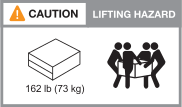

= Exigences d'installation pour les systèmes de stockage AFX 2K
:allow-uri-read: 
:icons: font
:imagesdir: ../media/

[role="lead"]
Examinez l'équipement nécessaire et les précautions de levage pour votre contrôleur de stockage AFX 2K et vos tiroirs disques.

[[equipment-needed-for-install]]
== Équipement nécessaire à l'installation

Pour installer votre système de stockage AFX 2K, vous avez besoin de l'équipement et des outils suivants.

* Accès à un navigateur Web pour configurer votre système de stockage
* Bracelet antistatique (ESD)
* Lampe de poche
* Ordinateur portable ou console avec une connexion USB/série
* Trombone ou stylo à bille à pointe étroite pour définir les identifiants des étagères de rangement
* Tournevis cruciforme n° 2

[[lifting-precautions]]
== Précautions de levage

Le contrôleur de stockage AFX et les étagères de stockage sont lourds.  Soyez prudent lorsque vous soulevez et déplacez ces objets.

[[storage-controller-weights]]
=== Poids du contrôleur de stockage

Prenez les précautions nécessaires lors du déplacement ou du levage de votre contrôleur de stockage AFX 2K.

Un contrôleur de stockage AFX 2K peut peser jusqu'à 64,0 lb (29,03 kg). Pour soulever le contrôleur de stockage, utilisez deux personnes ou un élévateur hydraulique.

.Précaution lors du levage du contrôleur AFX 2K.
image::../media/drw_afx_2k_weight_caution_ieops-2938.svg[Icône d'avertissement de levage du contrôleur AFX 2K]

[[storage-shelf-weights]]
=== Poids des étagères de stockage

Prenez les précautions nécessaires lorsque vous déplacez ou soulevez votre étagère.

.Étagère NX224
Une étagère NX224 peut peser jusqu'à 60,1 lb (27,3 kg). Pour soulever l'étagère, utilisez deux personnes ou un élévateur hydraulique. Gardez tous les composants dans l'étagère (à l'avant comme à l'arrière) afin d'éviter de déséquilibrer le poids de l'étagère.

.Précaution de levage du tiroir NX224.
image::../media/drw_nx224_lifting_weight_ieops-2437.svg[Icône d'avertissement de levage NX224 NSM100]

[[switch-weights]]
=== Poids des commutateurs

Prenez les précautions nécessaires lorsque vous déplacez ou soulevez votre switch.

.Cisco Nexus 9808
Un Cisco 9808 non chargé peut peser jusqu'à link:https://www.cisco.com/c/en/us/products/collateral/switches/nexus-9000-series-switches/nexus9800-series-switches-ds.html#Productspecifications["162 lb (73 kg) et un commutateur Cisco 9808 entièrement chargé peut atteindre 766 lb (347 kg)"^]. Pour soulever le commutateur, utilisez un élévateur hydraulique.

.Précaution de levage pour Cisco Nexus 9808 non chargé.

.Précaution de levage pour un Cisco Nexus 9808 entièrement chargé.
image::../media/drw_afx_2k_nexus9808_loaded_weight_caution_ieops-2940.svg[Icône d'avertissement de levage pour Cisco Nexus 9808 entièrement chargé]

.Cisco Nexus9332D-GX2B
Un Cisco 9332D-GX2B peut peser jusqu'à link:https://www.cisco.com/c/en/us/td/docs/dcn/hw/aci/nexus9000/9332d-gx2b/cisco-nexus-9332d-gx2b-aci-mode-switch-hardware-installation-guide/m_n93xxx_system_specs.html["12,7 kg (28,1 lb)"^].

.Cisco Nexus 9364D-GX2A
Un commutateur Cisco Nexus 9364D-GX2A peut peser jusqu'à link:https://www.cisco.com/c/en/us/td/docs/dcn/hw/nx-os/nexus9000/9364d-gx2a/cisco-nexus-9364d-gx2a-nx-os-mode-switch-hardware-installation-guide/m_n93xxx_system_specs.html["58 lb (26,3 kg)"^]. Pour soulever le commutateur, utilisez deux personnes ou un élévateur hydraulique.

.Précaution de levage pour Cisco Nexus 9364D-GX2A.
image::../media/drw_afx_2k_9364d_weight_caution_ieops-2942.svg[Icône d'avertissement de levage du Cisco Nexus 9364D-GX2A]

.Informations connexes
* https://library.netapp.com/ecm/ecm_download_file/ECMP12475945["Informations de sécurité et avis réglementaires"^]

.Quelle est la prochaine étape ?
Après avoir examiné les exigences matérielles, vous link:prepare-hardware.html["Préparez-vous à installer votre système de stockage AFX 2K"].
