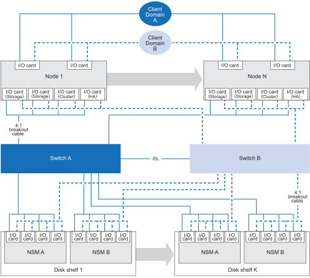

= Configurations prises en charge pour votre système de stockage AFX 1K
:allow-uri-read: 
:icons: font
:imagesdir: ../media/

[role="lead"]
Découvrez les composants matériels pris en charge et les options de câblage pour le système de stockage AFX 1K, y compris les étagères de disques de stockage compatibles, les commutateurs et les types de câbles requis pour une configuration système correcte.

== Configuration de câblage AFX 1K prise en charge

La configuration initiale du système de stockage AFX 1K prend en charge un minimum de quatre nœuds de contrôleur connectés via des commutateurs doubles aux étagères de disques de stockage.

Des nœuds de contrôleur et des étagères de disques supplémentaires étendent la configuration initiale du système de stockage AFX 1K.  Les configurations AFX 1K étendues suivent la même méthodologie de câblage basée sur un commutateur que le schéma illustré ci-dessous.

== Composants matériels pris en charge

Passez en revue les étagères de disques de stockage, les commutateurs et les types de câbles compatibles avec le système de stockage AFX 1K.

[cols="2,2,3,6"]
|===
| *Étagère de contrôleur* | *Étagère à disques* | *Commutateurs pris en charge* | *Câbles pris en charge* 

 a| 
AFX 1K
 a| 
NX224
 a| 
* Cisco Nexus 9332D-GX2B (400 GbE)
* Cisco Nexus 9364D-GX2A (400 GbE)

 a| 
* Câbles de dérivation QSFP-DD 400 GbE vers 4 câbles de dérivation QSFP 100 GbE
+

NOTE: Les câbles de dérivation sont utilisés pour les connexions 100 GbE entre les commutateurs, les contrôleurs et les étagères de disques.

+
** Câbles 100 GbE vers le cluster de contrôleurs et les ports HA
** Câbles 100 GbE vers les étagères de disques

* 2 câbles 400 GbE pour les connexions ISL entre le commutateur A et le commutateur B
* Câbles RJ-45 pour les connexions de gestion

|===
.Quelle est la prochaine étape ?
Après avoir examiné la configuration système et les composants matériels pris en charge,link:install-network-reqs.html["examinez les exigences réseau pour votre système de stockage AFX 1K"] .
