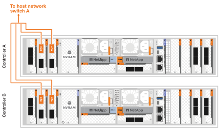

= Câblez le matériel de votre système de stockage AFX 1K
:allow-uri-read: 
:icons: font
:imagesdir: ../media/

[role="lead"]
Après avoir installé le matériel du rack pour votre système de stockage AFX 1K, installez les câbles réseau pour les contrôleurs et connectez les câbles entre les contrôleurs et les étagères de stockage.

.Avant de commencer
Contactez votre administrateur réseau pour obtenir des informations sur la connexion du système de stockage à vos commutateurs réseau.

.À propos de cette tâche
* Ces procédures montrent des configurations courantes.  Le câblage spécifique dépend des composants commandés pour votre système de stockage.  Pour obtenir des détails de configuration complets et les priorités des emplacements, voirlink:https://hwu.netapp.com["Hardware Universe NetApp"^] .
* Les emplacements d'E/S sur un contrôleur AFX sont numérotés de 1 à 11.
+
image::../media/drw_a1K_back_slots_labeled_ieops-2162.svg[Numérotation des emplacements sur un contrôleur AFX]

* Les graphiques de câblage affichent des icônes de flèche indiquant l'orientation correcte (vers le haut ou vers le bas) de la languette de traction du connecteur de câble lors de l'insertion d'un connecteur dans un port.
+
Lorsque vous insérez le connecteur, vous devez sentir un clic ; si vous ne le sentez pas, retirez-le, retournez-le et réessayez.

+
image:../media/drw_cable_pull_tab_direction_ieops-1699.svg["Direction de la languette de tirage du câble"]

+
[NOTE]
====
Les composants du connecteur sont délicats et il faut faire attention lors de leur mise en place.

====
* Lors du câblage vers une connexion à fibre optique, insérez l'émetteur-récepteur optique dans le port du contrôleur avant le câblage vers le port du commutateur.
* Le système de stockage AFX 1K utilise 4 câbles de dérivation 100 GbE sur le cluster et le réseau de stockage.  Les connexions 400 GbE sont établies sur les ports du commutateur, et les connexions 100 GbE sont établies sur les ports du contrôleur et de l'étagère de disques.  Les connexions de stockage et HA/Cluster peuvent être établies sur n'importe quel port non ISL du commutateur.
+
Pour une connexion donnée d'un câble de dérivation 4x100GbE à un port de commutateur spécifique, vous connectez les quatre ports d'un contrôleur donné au commutateur via ce seul câble de dérivation.

+
** 1 port HA (emplacement 1)
** 1 x port de cluster (emplacement 7)
** 2 ports de stockage (emplacements 10 et 11)
+
Tous les ports « a » sont connectés au commutateur A, et tous les ports « b » sont connectés au commutateur B.

NOTE: Les configurations de commutateur Cisco Nexus 9332D-GX2B et 9364D-GX2A pour le système de stockage AFX 1K nécessitent des connexions de câble de dérivation 4x100GbE.

== Étape 1 : connecter les contrôleurs au réseau de gestion

Connectez le port de gestion de chaque commutateur à l'un des commutateurs de gestion (si commandés) ou connectez-les directement à votre réseau de gestion.

Le port de gestion est le port supérieur droit situé sur le côté PSU du commutateur.  Le câble CAT6 de chaque commutateur doit être acheminé via le panneau de passage une fois les commutateurs installés pour se connecter aux commutateurs de gestion ou au réseau de gestion.

Utilisez les câbles RJ-45 1000BASE-T pour connecter les ports de gestion (clé) de chaque contrôleur aux commutateurs du réseau de gestion.

image::../media/oie_cable_rj45.png[câbles RJ-45]

*Câbles RJ-45 1000BASE-T*

image::../media/drw_afx_management_connection_ieops-2349.svg[Connectez-vous à votre réseau de gestion]

IMPORTANT: Ne branchez pas encore les cordons d’alimentation.

. Connectez-vous au réseau hôte.

== Étape 2 : connectez les contrôleurs au réseau hôte

Connectez les ports du module Ethernet à votre réseau hôte.

Cette procédure peut différer en fonction de la configuration de votre module d'E/S.  Voici quelques exemples typiques de câblage de réseau hôte.  Voirlink:https://hwu.netapp.com["Hardware Universe NetApp"^] pour votre configuration système spécifique.

.Étapes
. Connectez les ports suivants à votre commutateur de réseau de données Ethernet A.
+
** Contrôleur A (exemple)
+
*** e2a
*** e3a

** Contrôleur B (exemple)
+
*** e2a
*** e3a
+
*Câbles 100GbE*

+
image::../media/oie_cable100_gbe_qsfp28.png[Câble Ethernet 100 Gb]

+

. Connectez les ports suivants à votre commutateur de réseau de données Ethernet B.
+
** Contrôleur A (exemple)
+
*** e2b
*** e3b

** Contrôleur B (exemple)
+
*** e2b
*** e3b
+
*Câbles 100GbE*

+
image::../media/oie_cable100_gbe_qsfp28.png[Câble Ethernet 100 Gb]

+
image::../media/drw_afx_network_cabling_b_ieops-2351.svg[Câble vers réseau Ethernet]

== Étape 3 : Câbler les connexions du cluster et de la haute disponibilité

Utilisez le câble d'interconnexion Cluster et HA pour connecter les ports e1a et e7a au commutateur A et e1b et e7b au commutateur B. Les ports e1a/e1b sont utilisés pour les connexions HA et les ports e7a/e7b sont utilisés pour les connexions cluster.

.Étapes
. Connectez les ports de contrôleur suivants à n’importe quel port non ISL sur le commutateur réseau du cluster A.
+
** Contrôleur A
+
*** e1a (HA)
*** e7a (Cluster)

** Contrôleur B
+
*** e1a (HA)
*** e7a (Cluster)
+
*Câbles 100GbE*

+
image::../media/oie_cable_25Gb_Ethernet_SFP28_ieops-1069.png[Câble HA en cluster]

+
image::../media/drw_afx_switched_cluster_cabling_a_ieops-2352.svg[Connexions de cluster de câbles au réseau de cluster]

. Connectez les ports de contrôleur suivants à n’importe quel port non ISL sur le commutateur réseau du cluster B.
+
** Contrôleur A
+
*** e1b (HA)
*** e7b (Cluster)

** Contrôleur B
+
*** e1b (HA)
*** e7b (Cluster)
+
*Câbles 100GbE*

+
image::../media/oie_cable_25Gb_Ethernet_SFP28_ieops-1069.png[Câble HA en cluster]

+
image::../media/drw_afx_switched_cluster_cabling_b_ieops-2353.svg[Connexions de cluster de câbles au réseau de cluster]

== Étape 4 : Câblez les connexions de stockage du contrôleur au commutateur

Connectez les ports de stockage du contrôleur aux commutateurs.  Assurez-vous d’avoir les câbles et connecteurs appropriés pour vos commutateurs. Voir https://hwu.netapp.com["Hardware Universe"^] pour plus d'informations.

. Connectez les ports de stockage suivants à n’importe quel port non ISL du commutateur A.
+
** Contrôleur A
+
*** e10a
*** e11a

** Contrôleur B
+
*** e10a
*** e11a
+
*Câbles 100GbE*

+
image::../media/oie_cable100_gbe_qsfp28.png[Câble 100 Gb]

+
image::../media/drw_afx_controller_storage_cable_a_ieops-2354.svg[Stockage du contrôleur de câble vers le commutateur A]

. Connectez les ports de stockage suivants à n’importe quel port non ISL sur le commutateur B.
+
** Contrôleur A
+
*** e10b
*** e11b

** Contrôleur B
+
*** e10b
*** e11b
+
*Câbles 100GbE*

+
image::../media/oie_cable100_gbe_qsfp28.png[Câble 100 Gb]

+
image::../media/drw_afx_controller_storage_cable_b_ieops-2355.svg[Stockage du contrôleur de câble vers le commutateur B]

== Étape 5 : Câbler les connexions de l'étagère au commutateur

Connectez les étagères de stockage NX224 aux commutateurs.

Pour connaître le nombre maximal d'étagères prises en charge par votre système de stockage et toutes vos options de câblage, consultezlink:https://hwu.netapp.com["Hardware Universe NetApp"^] .

. Connectez les ports d'étagère suivants à n'importe quel port non ISL sur le commutateur A et le commutateur B pour le module A.
+
** Connexions du module A au commutateur A
+
*** e1a
*** e2a
*** e3a
*** e4a

** Connexions du module A au commutateur B
+
*** e1b
*** e2b
*** e3b
*** e4b
+
*Câbles 100GbE*

+
image::../media/oie_cable100_gbe_qsfp28.png[Câble 100 Gb]

+
image::../media/drw_afx_shelf_cabling_a_ieops-2356.svg[Étagère à câbles pour interrupteur A et interrupteur B]

. Connectez les ports d'étagère suivants à n'importe quel port non ISL sur le commutateur A et le commutateur B pour le module B.
+
** Connexions du module B au commutateur A
+
*** e1a
*** e2a
*** e3a
*** e4a

** Connexions du module B au commutateur B
+
*** e1b
*** e2b
*** e3b
*** e4b
+
*Câbles 100GbE*

+
image::../media/oie_cable100_gbe_qsfp28.png[Câble 100 Gb]

+
image::../media/drw_afx_shelf_cabling_b_ieops-2357.svg[Étagère à câbles pour interrupteur A et interrupteur B]

.Quelle est la prochaine étape ?
Après avoir câblé le matériel,link:power-on-configure-switch.html["allumer et configurer les commutateurs"] .
