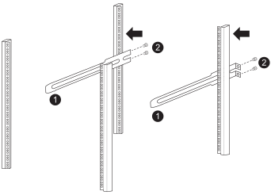

= Installez les commutateurs pour votre système de stockage AFX 1K
:allow-uri-read: 
:icons: font
:imagesdir: ../media/

[role="lead"]
Une fois la préparation de l'installation du système de stockage AFX 1K terminée, vous devez installer les commutateurs dans l'armoire ou le rack Telco.

Installez les commutateurs Cisco Nexus 9332D-GX2B ou 9364D-GX2A dans l'armoire ou le rack.  Installez un kit de panneau traversant si vous utilisez le commutateur Cisco Nexus 9364D-GX2A.

.Avant de commencer
Assurez-vous de disposer des composants suivants :

* Le kit de panneau traversant, disponible auprès de NetApp (numéro de pièce X8784-R6).
+
Le kit de panneau de transfert NetApp contient le matériel suivant :

+
** Un panneau d'obturation traversant
** Quatre vis 10-32 x 0,75
** Quatre écrous à clip 10-32

* Pour chaque interrupteur, huit vis 10-32 ou 12-24 et écrous à clip pour monter les supports et les rails coulissants sur les montants avant et arrière de l'armoire.
* Le kit de rail standard Cisco pour installer le commutateur dans une armoire NetApp .

NOTE: Les cordons de démarrage ne sont pas inclus avec le kit de passage.  Contactez NetApp pour commander les câbles de démarrage appropriés s’ils ne sont pas livrés avec vos commutateurs.

NOTE: Les Cisco 9332D-GX2B et 9364D-GX2A sont des commutateurs d'admission côté port.  Les ports réseau des commutateurs doivent être installés face à l'avant de l'armoire et les ventilateurs d'extraction doivent être orientés vers l'arrière de l'armoire.  Avec cette configuration, vous devez vous assurer d'utiliser des câbles suffisamment longs pour aller des ports réseau situés à l'avant de l'armoire aux ports de stockage situés à l'arrière de l'armoire.  + Pour des informations plus détaillées sur ces commutateurs, veuillez visiter le site Web de Cisco : https://www.cisco.com/c/en/us/td/docs/dcn/hw/nx-os/nexus9000/9332d-gx2b/cisco-nexus-9332d-gx2b-nx-os-mode-switch-hardware-installation-guide.html["Guide d'installation du commutateur Cisco Nexus 9332D-GX2B NX-OS"^] et https://www.cisco.com/c/en/us/td/docs/dcn/hw/nx-os/nexus9000/9364d-gx2a/cisco-nexus-9364d-gx2a-nx-os-mode-switch-hardware-installation-guide.html["Guide d'installation du commutateur Cisco Nexus 9364D-GX2A NX-OS"^] .

.Étapes
. Installer le panneau d'obturation traversant.
+
.. Déterminez l’emplacement vertical des commutateurs et du panneau d’obturation dans l’armoire ou le rack.
.. Installez deux écrous à clip de chaque côté dans les trous carrés appropriés pour les rails avant de l'armoire.
.. Centrez le panneau verticalement pour éviter toute intrusion dans l'espace rack adjacent, puis serrez les vis.
.. Insérez les connecteurs femelles des deux cordons de démarrage depuis l’arrière du panneau et à travers l’ensemble de brosses.
+
image::../media/cisco_9148_jumper_cords.gif[Connecteurs femelles du cordon de démarrage]

+
[cols="1,4"]
|===

 a| 
image::../media/icon_round_1.png[Numéro d'appel 1]
 a| 
Connecteur femelle du cordon de démarrage.

|===

. Installez les supports de montage en rack sur le châssis du commutateur.
+
.. Placez un support de montage en rack avant sur un côté du châssis du commutateur de sorte que l'oreille de montage soit alignée avec la plaque frontale du châssis (côté bloc d'alimentation ou ventilateur), puis utilisez quatre vis M4 pour fixer le support au châssis.
+
image::../media/3132q_front_bracket.gif[support avant]

.. Répétez l’étape 2a avec l’autre support de montage en rack avant de l’autre côté du commutateur.
.. Installez le support de montage en rack arrière sur le châssis du commutateur.
.. Répétez l’étape 2c avec l’autre support de montage en rack arrière de l’autre côté du commutateur.

. Installez les écrous à clip dans les emplacements des trous carrés pour les quatre poteaux IEA.
+
image::../media/ru_locations_for_3132q_v.gif[Emplacements des écrous de serrage]

+
Montez les deux commutateurs 9332D-GX2B dans des emplacements d'armoire offrant un accès efficace aux contrôleurs et aux étagères, tels que les rangées du milieu.

. Installez les rails coulissants dans l’armoire ou le rack.
+
.. Positionnez le premier rail coulissant à l'emplacement souhaité à l'arrière du montant arrière gauche, insérez les vis avec le type de filetage correspondant, puis serrez les vis avec vos doigts.
+

+
[cols="1,4"]
|===

 a| 
image::../media/icon_round_1.png[Numéro d'appel 1]
 a| 
Pendant que vous faites glisser doucement le rail coulissant, alignez-le sur les trous de vis du rack.

 a| 
image::../media/icon_round_2.png[Numéro d'appel 2]
 a| 
Serrez les vis des rails coulissants sur les montants de l’armoire.

|===
.. Répétez l’étape 4a pour le montant arrière droit.
.. Répétez les étapes 4a et 4b aux emplacements souhaités sur l’armoire.

. Installez le commutateur dans l’armoire ou le rack.
+

NOTE: Cette étape nécessite deux personnes : une personne pour soutenir l'interrupteur par l'avant et une autre pour guider l'interrupteur dans les rails coulissants arrière.

+
.. Positionnez l’arrière de l’interrupteur à l’emplacement souhaité sur l’armoire.
+
image::../media/drw_switch_cabinet_position_generic_ieops-2348.svg[Positionnement 3232C à U39-40]

+
[cols="1,4"]
|===

 a| 
image::../media/icon_round_1.png[Numéro d'appel 1]
 a| 
Lorsque le châssis est poussé vers les montants arrière, alignez les deux guides de montage en rack arrière avec les rails coulissants

 a| 
image::../media/icon_round_2.png[Numéro d'appel 2]
 a| 
Faites glisser doucement le commutateur jusqu'à ce que les supports de montage en rack avant soient au même niveau que les montants avant.

|===
.. Fixez l’interrupteur à l’armoire ou au rack.
+
image::../media/3132q_attaching.gif[Accessoire de commutation]

+
[cols="1,4"]
|===

 a| 
image::../media/icon_round_1.png[Numéro d'appel 1]
 a| 
Pendant qu'une personne maintient l'avant du châssis à niveau, l'autre personne doit serrer complètement les quatre vis arrière sur les montants de l'armoire.

|===
.. Le châssis étant désormais soutenu sans assistance, serrez complètement les vis avant sur les poteaux.
.. Répétez les étapes 5a à 5c pour le deuxième commutateur à l’emplacement souhaité sur l’armoire.
+

NOTE: En utilisant l'interrupteur entièrement installé comme support, il n'est pas nécessaire de tenir l'avant du deuxième interrupteur pendant le processus d'installation.

. Une fois les commutateurs installés, connectez les cordons de démarrage aux entrées d’alimentation des commutateurs.
. Connectez les fiches mâles des deux cordons de démarrage aux prises PDU disponibles les plus proches.
+

NOTE: Pour maintenir la redondance, les deux cordons doivent être connectés à des PDU différents.

. Connectez le port de gestion de chaque commutateur à l'un des commutateurs de gestion (si commandés) ou connectez-les directement à votre réseau de gestion.
+
Le port réseau de gestion est le port RJ-45 inférieur près du bloc d'alimentation de droite.  Acheminez le câble CAT6 de chaque commutateur via le panneau de passage après avoir installé les commutateurs pour vous connecter aux commutateurs de gestion ou au réseau.

.Quelle est la prochaine étape ?
Après avoir installé les commutateurs dans l'armoire ou le rack, vouslink:deploy-hardware.html["installer le système de stockage AFX 1K et les étagères dans l'armoire ou le rack"] .
