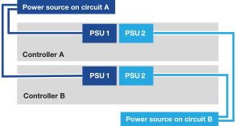

= Allumez votre système de stockage AFX 1K
:allow-uri-read: 
:icons: font
:imagesdir: ../media/

[role="lead"]
Après avoir installé le matériel du rack pour votre système de stockage AFX 1K et installé les câbles pour les nœuds de contrôleur et les étagères de stockage, vous devez mettre sous tension vos étagères de stockage et vos nœuds de contrôleur.

== Étape 1 : Allumez l’étagère et attribuez-lui un identifiant.

Chaque étagère possède un identifiant unique, garantissant sa distinction dans la configuration de votre système de stockage.

.À propos de cette tâche
* Un identifiant d'étagère valide est compris entre 01 et 99.
* Vous devez redémarrer une étagère (débrancher les deux cordons d'alimentation, attendre au moins 10 secondes, puis les rebrancher) pour que l'ID de l'étagère prenne effet.

.Étapes
. Mettez l'étagère sous tension en connectant d'abord les cordons d'alimentation à l'étagère, en les fixant en place avec le dispositif de retenue du cordon d'alimentation, puis en connectant les cordons d'alimentation à des sources d'alimentation sur différents circuits.
+
L'étagère s'allume et démarre automatiquement lorsqu'elle est branchée.

. Retirez le capuchon d'extrémité gauche pour accéder au bouton d'identification de l'étagère derrière la plaque frontale.
+
image::../media/drw_tp_change_shelf_id_ieops-2381.svg[Modifier l'ID de l'étagère NX224]

+
[cols="20%,80%"]
|===

 a| 
image::../media/icon_round_1.png[Numéro d'appel 1]
 a| 
Embout d'étagère

 a| 
image::../media/icon_round_2.png[[Appel numéro 2]
 a| 
Façade d'étagère

 a| 
image::../media/icon_round_3.png[[Appel numéro 3]
 a| 
Numéro d'identification de l'étagère

 a| 
image::../media/icon_round_4.png[[Appel numéro 4]
 a| 
Bouton d'identification de l'étagère

|===
. Modifier le premier numéro de l'ID de l'étagère :
+
.. Insérez l’extrémité redressée d’un trombone ou d’un stylo à bille à pointe étroite dans le petit trou pour appuyer doucement sur le bouton d’identification de l’étagère.
.. Appuyez doucement sur le bouton d'identification de l'étagère et maintenez-le enfoncé jusqu'à ce que le premier chiffre sur l'affichage numérique clignote, puis relâchez le bouton.
+
Le numéro clignote dans les 15 secondes, activant le mode de programmation de l'ID d'étagère.

+

NOTE: Si l'ID met plus de 15 secondes à clignoter, appuyez à nouveau sur le bouton d'identification de l'étagère et maintenez-le enfoncé, en veillant à l'enfoncer complètement.

.. Appuyez et relâchez le bouton d'identification de l'étagère pour faire avancer le numéro jusqu'à ce que vous atteigniez le numéro souhaité de 0 à 9.
+
Chaque durée d'appui et de relâchement peut être aussi courte qu'une seconde.

+
Le premier chiffre continue de clignoter.

. Modifiez le deuxième numéro de l'ID de l'étagère :
+
.. Appuyez sur le bouton et maintenez-le enfoncé jusqu'à ce que le deuxième chiffre sur l'écran numérique clignote.
+
Le clignotement du numéro peut prendre jusqu’à trois secondes.

+
Le premier chiffre sur l’affichage numérique cesse de clignoter.

.. Appuyez et relâchez le bouton d'identification de l'étagère pour faire avancer le numéro jusqu'à ce que vous atteigniez le numéro souhaité de 0 à 9.
+
Le deuxième chiffre continue de clignoter.

. Verrouillez le numéro souhaité et quittez le mode de programmation en appuyant sur le bouton d'identification de l'étagère et en le maintenant enfoncé jusqu'à ce que le deuxième numéro cesse de clignoter.
+
Il peut falloir jusqu’à trois secondes pour que le numéro cesse de clignoter.

+
Les deux chiffres sur l'écran numérique commencent à clignoter et la LED orange s'allume après environ cinq secondes, vous avertissant que l'ID d'étagère en attente n'a pas encore pris effet.

. Mettez l'étagère hors tension puis sous tension pendant au moins 10 secondes pour que l'ID de l'étagère prenne effet.
+
.. Débranchez le cordon d’alimentation des deux blocs d’alimentation de l’étagère.
.. Attendez 10 secondes.
.. Rebranchez les cordons d’alimentation dans les blocs d’alimentation de l’étagère pour terminer le cycle d’alimentation.
+
L'alimentation s'allume dès que vous branchez le cordon d'alimentation.  Sa LED bicolore doit s'allumer en vert.

. Remettez le capuchon d’extrémité gauche.

== Étape 2 : Mettre sous tension les nœuds du contrôleur

Après avoir activé vos étagères de stockage et leur avoir attribué des identifiants uniques, mettez sous tension les nœuds du contrôleur de stockage.

.Étapes
. Connectez votre ordinateur portable au port de console série.  Cela vous permet de surveiller la séquence de démarrage lorsque les contrôleurs sont sous tension.
+
.. Réglez le port de console série de l'ordinateur portable sur 115 200 bauds avec N-8-1.
+
Consultez l’aide en ligne de votre ordinateur portable pour obtenir des instructions sur la configuration du port de console série.

.. Connectez le câble de la console à l’ordinateur portable et connectez le port de console série sur le contrôleur à l’aide du câble de console fourni avec votre système de stockage.
.. Connectez l’ordinateur portable au commutateur sur le sous-réseau de gestion.
+
image::../media/drw_afx_1k_console_connection_ieops-2708.svg[Connexions de la console]

. Attribuez une adresse TCP/IP à l’ordinateur portable, en utilisant une adresse qui se trouve sur le sous-réseau de gestion.
. Branchez les cordons d’alimentation dans les blocs d’alimentation du contrôleur, puis connectez-les à des sources d’alimentation sur différents circuits.
+

+
** Le système commence à démarrer.  Le démarrage initial peut prendre jusqu'à huit minutes.
** Les LED clignotent et les ventilateurs démarrent, indiquant que les contrôleurs sont sous tension.
** Les ventilateurs peuvent être bruyants au démarrage, ce qui est normal.

. Fixez les cordons d’alimentation à l’aide du dispositif de fixation présent sur chaque bloc d’alimentation.

.Quelle est la prochaine étape ?
Après avoir allumé votre système de stockage AFX 1K, vouslink:../install-setup/cluster-setup.html["configurer un cluster AFX"] .
